<p align="center">
  <a href="https://github.com/ESAOpenSR/opensr-test"></a>
</p>

<p align="center">
    <em>
    A comprehensive benchmark for real-world Sentinel-2 imagery super-resolution
    </em>
</p>

<p align="center">
<a href='https://pypi.python.org/pypi/opensr-test'>

</a>
<a href="https://opensource.org/licenses/MIT" target="_blank">
    
</a>
<a href="https://github.com/psf/black" target="_blank">
    
</a>
<a href="https://pycqa.github.io/isort/" target="_blank">
    
</a>
</p>

---

**GitHub**: [https://github.com/ESAOpenSR/opensr-test](https://github.com/ESAOpenSR/opensr-test)

**Documentation**: [https://esaopensr.github.io/opensr-test](https://esaopensr.github.io/opensr-test)

**PyPI**: [https://pypi.org/project/opensr-test/](https://pypi.org/project/opensr-test/)

**Paper**: [https://ieeexplore.ieee.org/document/10530998](https://ieeexplore.ieee.org/document/10530998)

---

#

## **Overview**

Super-Resolution (SR) aims to improve satellite imagery ground sampling distance. However, two problems are common in the literature. First, most models are **tested on synthetic data**, raising doubts about their real-world applicability and performance. Second, traditional evaluation metrics such as PSNR, LPIPS, and SSIM are not designed to assess SR performance. These metrics fall short, especially in conditions involving changes in luminance or spatial misalignments - scenarios frequently encountered in real world.

To address these challenges, 'opensr-test' provides a fair approach for SR benchmark. We provide three datasets carefully crafted to minimize spatial and spectral misalignment. Besides, 'opensr-test' precisely assesses SR algorithm performance across three independent metrics groups that measure consistency, synthesis, and correctness.

<p align="center">
  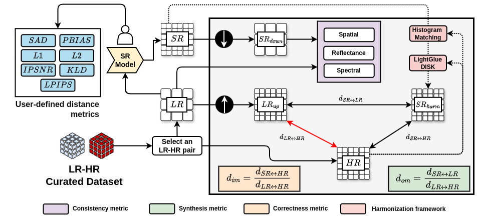
</p>

## **How to use**

The example below shows how to use `opensr-test` to benchmark your SR model.


```python
import torch
import opensr_test

lr = torch.rand(4, 64, 64)
hr = torch.rand(4, 256, 256)
sr = torch.rand(4, 256, 256)

metrics = opensr_test.Metrics()
metrics.compute(lr=lr, sr=sr, hr=hr)
>>> {'reflectance': 0.253, 'spectral': 26.967, 'spatial': 1.0, 'synthesis': 0.2870, 'ha_percent': 0.892, 'om_percent': 0.0613, 'im_percent': 0.04625}
```

This model returns:

- **reflectance**: How SR affects the reflectance norm of the LR image. By default, it uses the L1 distance. The lower the value, the better the reflectance consistency.

- **spectral**: How SR affects the spectral signature of the LR image. By default, it uses the spectral angle distance (SAD). The lower the value, the better the spectral consistency. The angles are in degrees.

- **spatial**: The spatial alignment between the SR and LR images. By default, it uses Phase Correlation Coefficient (PCC). Some SR models introduce spatial shift, which can be detected by this metric.

- **synthesis**: The high-frequency details introduced by the SR model. By default, it uses the L1 distance. The higher the value, the better the synthesis quality.

- **ha_metric**: The amount of hallucinations in the SR image. A hallucination is a detail (high-gradient) in the SR image that **is not present in the HR image.** The lower the value, the better the correctness of the SR image.

- **om_metric**: The amount of omissions in the SR image. An omission is a detail in the HR image that **is not present in the SR image.** The lower the value, the better the correctness of the SR image.

- **im_metric**: The amount of improvements in the SR image. An improvement is a detail in the SR image that **is present in the HR image and not in the LR image.** The higher the value, the better the correctness of the SR image.

## **Benchmark**

Benchmark comparison of SR models. Downward arrows (↓) denote metrics in which lower values are preferable, and upward arrows (↑) indicate that higher values reflect better performance. This table is an improved version of the one presented in the paper, reflecting the enhancements applied to the datasets. To get the datasets used in the paper, set the `dataset` parameter to `version=020`.


## **Installation**

Install the latest version from PyPI:

```
pip install opensr-test
pip install opensr-test[perceptual] # Install to test perceptual metrics
```

Upgrade `opensr-test` by running:

```
pip install -U opensr-test
```

Install the latest dev version from GitHub by running:

```
pip install git+https://github.com/ESAOpenSR/opensr-test
```

## **Datasets**

The `opensr-test` package provides five datasets for benchmarking SR models. These datasets are carefully crafted to minimize spatial and spectral misalignment. See our Hugging Face repository for more details about the datasets. [**https://huggingface.co/datasets/isp-uv-es/opensr-test**](https://huggingface.co/datasets/isp-uv-es/opensr-test)

| Dataset | Scale factor | Number of images | HR patch size |
|---------|--------------|-------------------|--------------|
| NAIP    | x4           | 62               | 484x484       |
| SPOT    | x4           | 9               | 512x512       |
| Venµs   | x2           | 59               | 256x256       |
| SPAIN CROPS | x4       | 28               | 512x512       |
| SPAIN URBAN | x4       | 20               | 512x512       |


### **NAIP (X4 scale factor)**

The National Agriculture Imagery Program (NAIP) dataset is a high-resolution aerial imagery dataset that covers the continental United States. The dataset consists of 2.5m NAIP imagery captured in the visible and near-infrared spectrum (RGBNIR) and all Sentinel-2 L1C and L2A bands. The dataset focus in **crop fields, forests, and bare soil areas**.

```python
import opensr_test

naip = opensr_test.load("naip")
```

<p align="center">
  <a href="https://github.com/ESAOpenSR/opensr-test">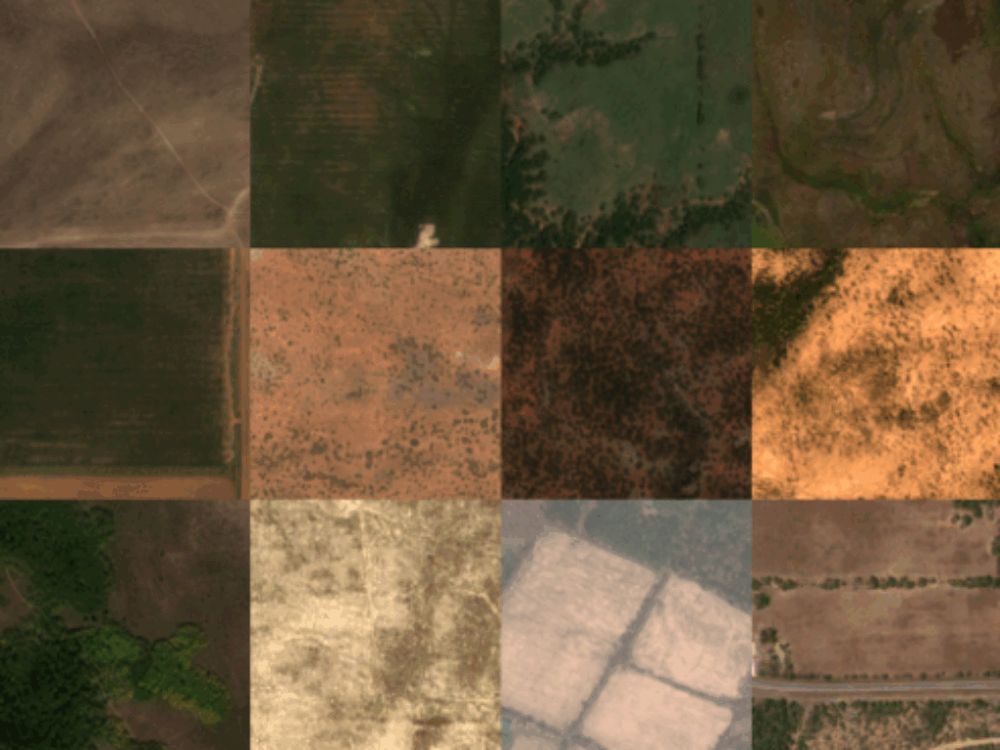</a>
</p>

### **SPOT (X4 scale factor)**

The SPOT imagery were obtained from the worldstat dataset. The dataset consists of 2.5m SPOT imagery captured in the visible and near-infrared spectrum (RGBNIR) and all Sentinel-2 L1C and L2A bands. The dataset focus in **urban areas, crop fields, and bare soil areas**.

```python
import opensr_test

spot = opensr_test.load("spot")
```

<p align="center">
  <a href="https://github.com/ESAOpenSR/opensr-test">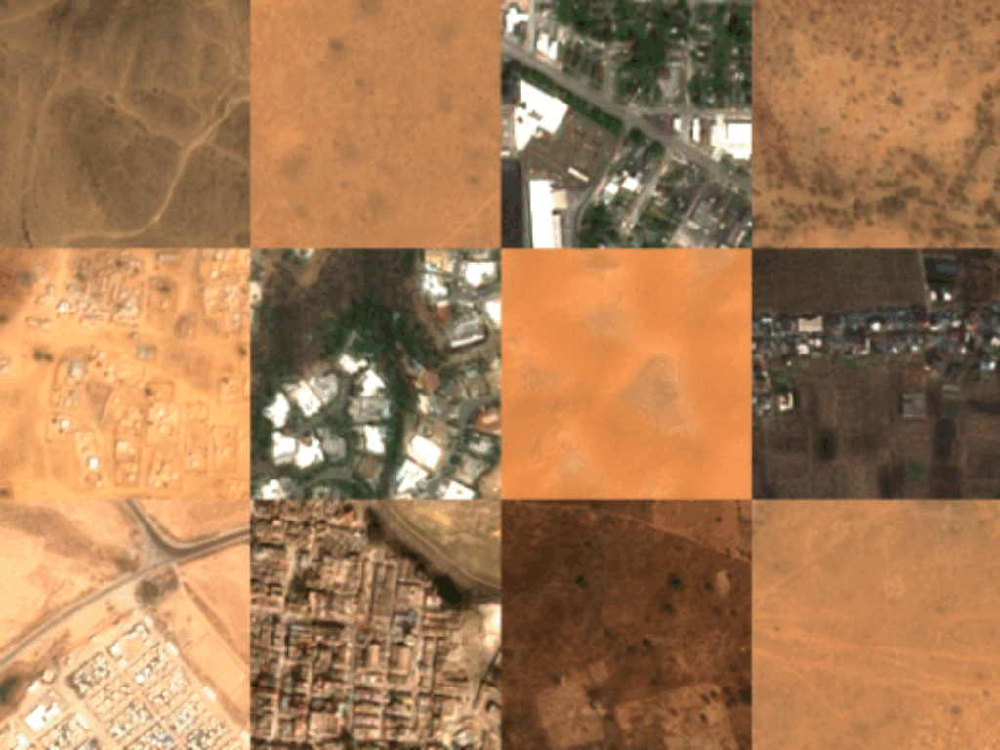</a>
</p>


### **Venµs (X2 scale factor)**

The Venµs images were obtained from the [**Sen2Venµs dataset**](https://zenodo.org/records/6514159). The dataset consists of 5m Venµs imagery captured in the visible and near-infrared spectrum (RGBNIR) and all Sentinel-2 L1C and L2A bands. The dataset focus in **crop fields, forests, urban areas, and bare soil areas**.

```python
import opensr_test

venus = opensr_test.load("venus")
```

<p align="center">
  <a href="https://github.com/ESAOpenSR/opensr-test">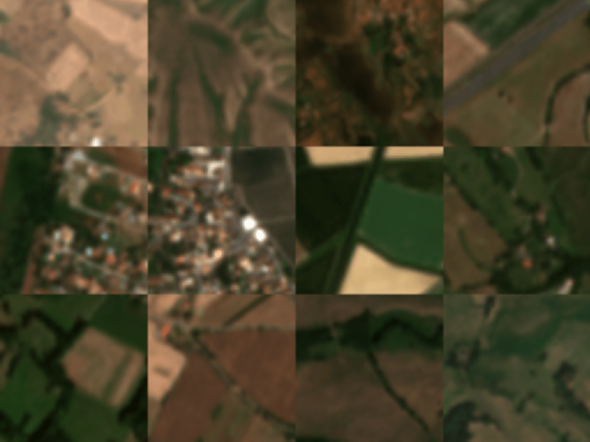</a>
</p>


### **SPAIN CROPS (x4 scale factor)**

The SPAIN CROPS dataset consists of 2.5m aerial imagery captured in the visible and near-infrared spectrum (RGBNIR) by the Spanish National Geographic Institute (IGN). The dataset includes all Sentinel-2 L1C and L2A bands. The dataset focus in **crop fields and forests**.

```python
import opensr_test

spain_crops = opensr_test.load("spain_crops")
```

<p align="center">
  <a href="https://github.com/ESAOpenSR/opensr-test">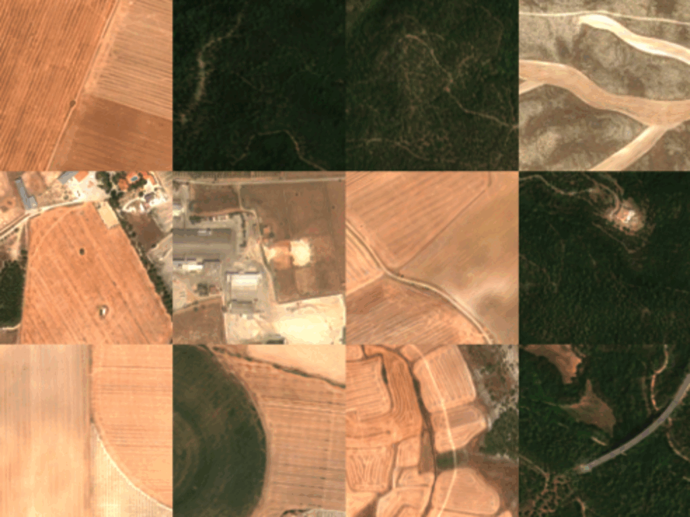</a>
</p>


### **SPAIN URBAN (x4 scale factor)**

The SPAIN URBAN dataset consists of 2.5m aerial imagery captured in the visible and near-infrared spectrum (RGBNIR) by the Spanish National Geographic Institute (IGN). The dataset includes all Sentinel-2 L1C and L2A bands. The dataset focus in **urban areas**.

```python

spain_urban = opensr_test.load("spain_urban")
```

<p align="center">
  <a href="https://github.com/ESAOpenSR/opensr-test">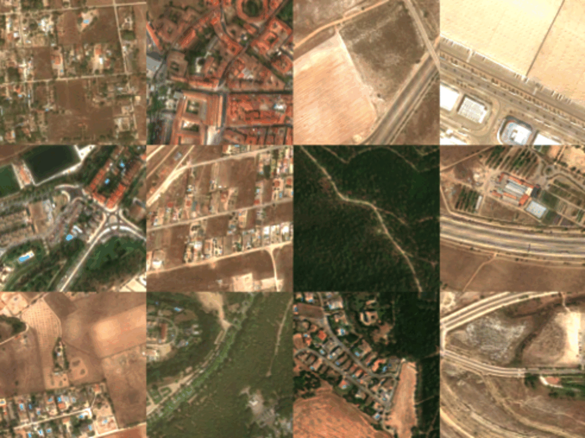</a>
</p>


## **Examples**

The following examples show how to use `opensr-test` to benchmark your SR model.

| Model | Framework | Link |
|-------|-----------|------|
| SR4RS | TensorFlow | [](https://huggingface.co/isp-uv-es/superIX/blob/main/sr4rs/run.py) |
| SuperImage | PyTorch | [](https://huggingface.co/isp-uv-es/superIX/blob/main/superimage/run.py) |
| LDMSuperResolutionPipeline | Diffuser | [](https://huggingface.co/isp-uv-es/superIX/blob/main/ldm/run.py) |
| opensr-model | Pytorch | [](https://huggingface.co/isp-uv-es/superIX/blob/main/opensr/run.py) |
| EvoLand | Pytorch | [](https://huggingface.co/isp-uv-es/superIX/blob/main/evoland/run.py) |
| SWIN2-MOSE | Pytorch | [](https://huggingface.co/isp-uv-es/superIX/blob/main/swin2mose/run.py) |
| Synthetic | Pytorch | [](https://huggingface.co/isp-uv-es/superIX/blob/main/synthetic/run.py) |


## **Visualizations**

The `opensr-test` package provides a set of visualizations to help you understand the performance of your SR model.

```python
import torch
import opensr_test
import matplotlib.pyplot as plt

from super_image import HanModel

# Define the SR model
srmodel = HanModel.from_pretrained('eugenesiow/han', scale=4)
srmodel.eval()

# Load the data
dataset = opensr_test.load("spot")
lr, hr = dataset["L2A"], dataset["HRharm"]

# Define the benchmark experiment
config = opensr_test.Config()
metrics = opensr_test.Metrics(config=config)

# Define the image to be tested
idx = 0
lr_img = torch.from_numpy(lr[idx, 0:3]) / 10000
hr_img = torch.from_numpy(hr[idx, 0:3]) / 10000
with torch.no_grad():
    sr_img = srmodel(lr_img[None]).squeeze()

# Compute the metrics
metrics.compute(
    lr=lr_img, sr=sr_img, hr=hr_img
)
```

Now, we can visualize the results using the `opensr_test.visualize` module.
fDisplay the triplets LR, SR and HR images:

```python
metrics.plot_triplets()
```

<p align="center">
  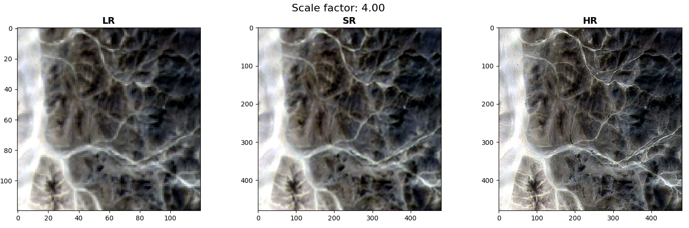
</p>

Display a summary of all the metrics:

```python
metrics.plot_summary()
```

<p align="center">
  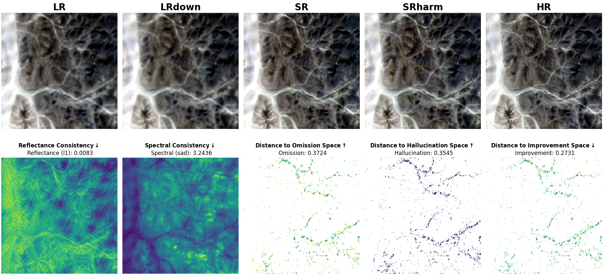
</p>


Display the correctness of the SR image:

```python
metrics.plot_tc()
```

<p align="center">
  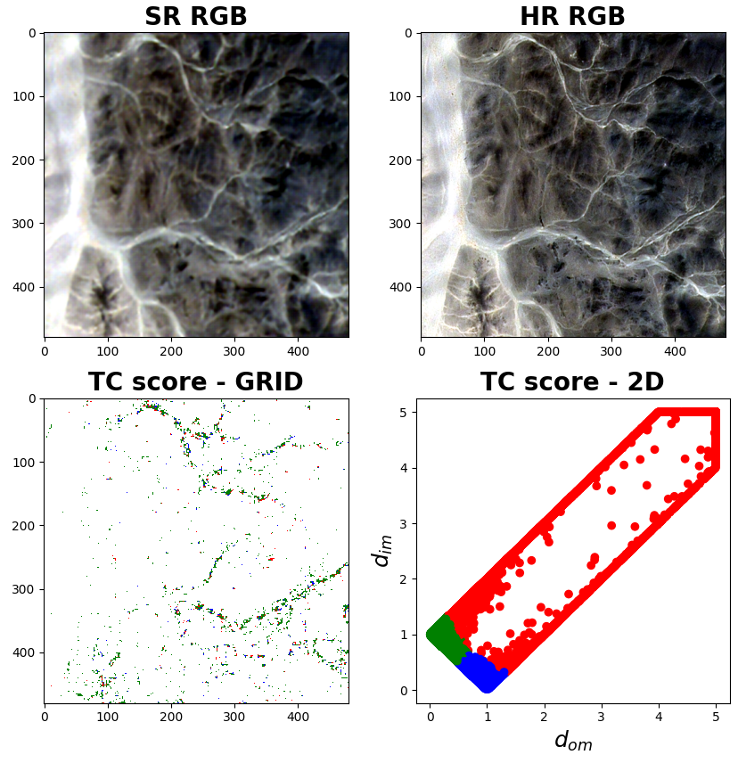
</p>


Display the histogram of the metrics:

```python
metrics.plot_stats()
```

<p align="center">
  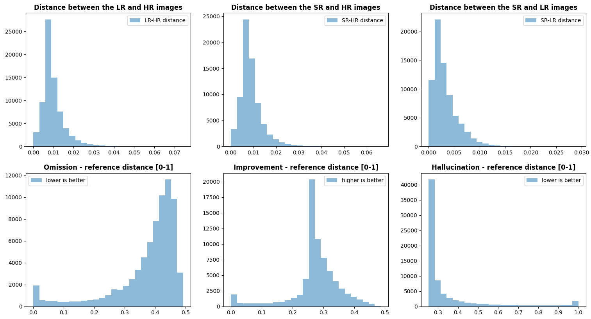
</p>

Display a ternary plot of the metrics:

```python
metrics.plot_ternary()
```

<p align="center">
  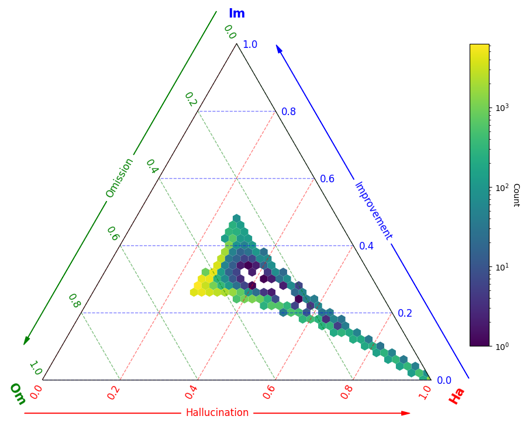
</p>

## **Deeper understanding**

Explore the [**API**](https://esaopensr.github.io/opensr-test/docs/API/config_pydantic.html) section for more details about personalizing your benchmark experiments.

## **Citation**

If you use `opensr-test` in your research, please cite our paper:

```
@ARTICLE{10530998,
  author={Aybar, Cesar and Montero, David and Donike, Simon and Kalaitzis, Freddie and Gómez-Chova, Luis},
  journal={IEEE Geoscience and Remote Sensing Letters}, 
  title={A Comprehensive Benchmark for Optical Remote Sensing Image Super-Resolution}, 
  year={2024},
  volume={21},
  number={},
  pages={1-5},
  keywords={Measurement;Remote sensing;Spatial resolution;Superresolution;Reflectivity;Protocols;Inspection;Benchmarking;datasets;deep learning;NAIP;Sentinel-2 (S2);SPOT;super-resolution (SR)},
  doi={10.1109/LGRS.2024.3401394}}
```

## **Acknowledgements**

This work was make with the support of the European Space Agency (ESA) under the project “Explainable AI: application to trustworthy super-resolution (OpenSR)”. Cesar Aybar acknowledges support by the National Council of Science, Technology, and Technological Innovation (CONCYTEC, Peru) through the “PROYECTOS DE INVESTIGACIÓN BÁSICA – 2023-01” program with contract number PE501083135-2023-PROCIENCIA. Luis Gómez-Chova acknowledges support from the Spanish Ministry of Science and Innovation (project PID2019-109026RB-I00 funded by MCIN/AEI/10.13039/501100011033).
