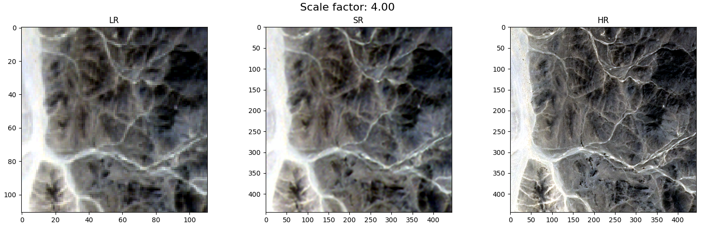
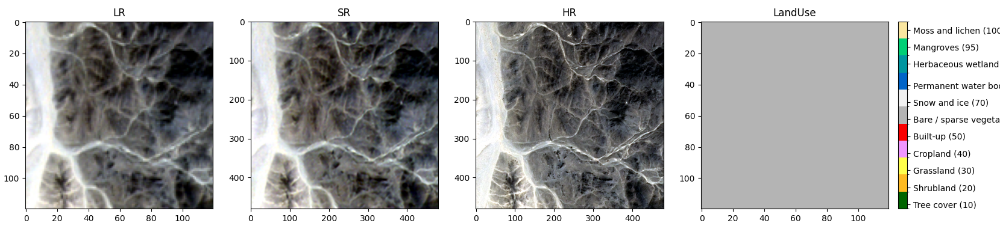
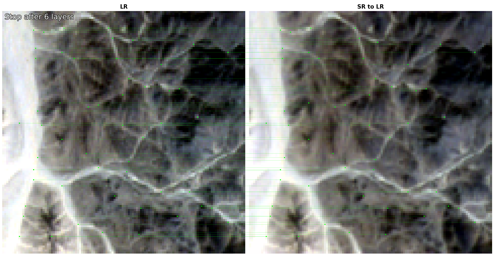
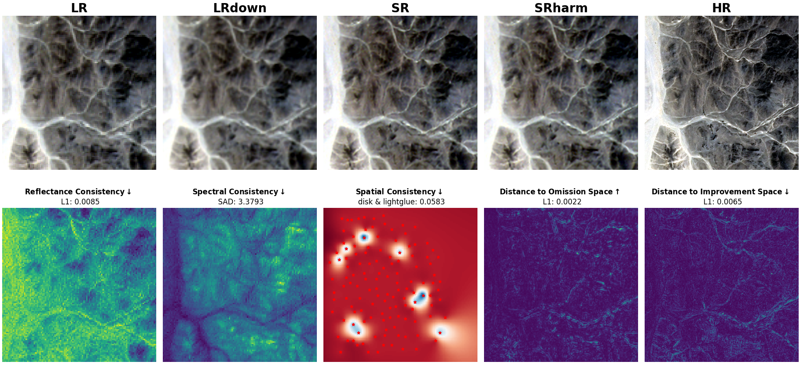
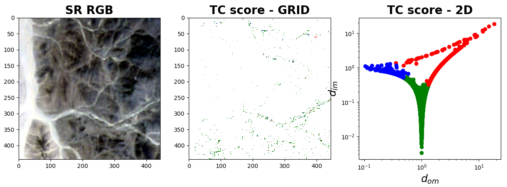

<p align="center">
  <a href="https://github.com/ESAOpenSR/opensr-test"></a>
</p>

<p align="center">
    <em>A comprehensive benchmark for real-world Sentinel-2 imagery super-resolution</em>
</p>

<p align="center">
<a href='https://pypi.python.org/pypi/opensr-test'>
    
</a>

<a href="https://opensource.org/licenses/MIT" target="_blank">
    
</a>
<a href='https://opensr-test.readthedocs.io/en/latest/?badge=main'>
    
</a>
<a href="https://github.com/psf/black" target="_blank">
    
</a>
<a href="https://pycqa.github.io/isort/" target="_blank">
    
</a>
</p>

---

**GitHub**: [https://github.com/ESAOpenSR/opensr-test](https://github.com/ESAOpenSR/opensr-test)

**Documentation**: [https://esaopensr.github.io/opensr-test](https://esaopensr.github.io/opensr-test)

**PyPI**: [https://pypi.org/project/opensr-test/](https://pypi.org/project/opensr-test/)

**Paper**: Coming soon!

---

#

## Overview

In remote sensing, Image Super-Resolution (ISR) goal is to improve the ground sampling distance. However, two problems are common in the literature. First, most models are **tested on synthetic data**, raising doubts about their real-world applicability and performance. Second, traditional evaluation metrics such as PSNR, LPIPS, and SSIM are not designed for assessing ISR performance. These metrics fall short, especially in conditions involving changes in luminance or spatial misalignments - scenarios that are frequently encountered in remote sensing imagery.

To address these challenges, 'opensr-test' provides a fair approach for ISR benchmark. We provide **three datasets** that were carefully crafted to minimize spatial and spectral misalignment. Besides, 'opensr-test' precisely assesses ISR algorithm performance across **three independent metrics groups** that measure *consistency*, *synthesis*, and *correctness*.

## How to use

The example below shows how to use `opensr-test` to benchmark your SR model.

```python
import torch
import opensr_test

lr = torch.rand(4, 64, 64)
hr = torch.rand(4, 256, 256)
sr = torch.rand(4, 256, 256)

metrics = opensr_test.Metrics()
metrics.compute(lr=lr, sr=sr, hr=hr)
```

## Benchmark

Benchmark comparison of SR models. Downward arrows (↓) denote metrics in which lower values are preferable, and upward arrows (↑) indicate metrics in which higher values reflect better performance.

<table border="1" style="width:75%; text-align:center;">    
    <thead>
        <tr>
            <th colspan="2"></th>
            <th colspan="3">Consistency</th>
            <th>Synthesis</th>
            <th colspan="3">Correctness</th>
        </tr>
        <tr>
            <th colspan="2"></th>
            <th>reflectance ↓</th>
            <th>spectral ↓</th>
            <th>spatial ↓</th>
            <th>high-frequency ↑</th>
            <th>ha ↓</th>
            <th>om ↓</th>
            <th>im ↑</th>
        </tr>
    </thead>
    <tbody>
        <tr>
            <td rowspan="3"><b>NAIP</b></td>
            <td><b>SuperImage</b></td>
            <td><b>0.008</b></td>
            <td><b>7.286</b></td>
            <td><b>0.131</b></td>
            <td>0.003</td>
            <td><b>0.117</b></td>
            <td><b>0.784</b></td>
            <td><b>0.098</b></td>
        </tr>
        <tr>
            <td><b>SR4RS</b></td>
            <td>0.016</td>
            <td><b>3.471</b></td>
            <td>1.156</td>
            <td>0.010</td>
            <td>0.869</td>
            <td>0.077</td>
            <td>0.054</td>
        </tr>
        <tr>
            <td><b>diffusers</b></td>
            <td>0.463</td>
            <td>12.437</td>
            <td>2.88</td>
            <td><b>0.013</b></td>
            <td>0.905</td>
            <td>0.055</td>
            <td>0.040</td>
        </tr>
        <tr>
            <td rowspan="3"><b>SPOT</b></td>
            <td><b>SuperImage</b></td>
            <td><b>0.009</b></td>
            <td>3.512</td>
            <td><b>0.062</b></td>
            <td>0.006</td>
            <td><b>0.160</b></td>
            <td><b>0.794</b></td>
            <td><b>0.046</b></td>
        </tr>
        <tr>
            <td><b>SR4RS</b></td>
            <td>0.039</td>
            <td><b>3.232</b></td>
            <td>1.151</td>
            <td><b>0.023</b></td>
            <td>0.834</td>
            <td>0.115</td>
            <td>0.051</td>
        </tr>
        <tr>
            <td><b>diffusers</b></td>
            <td>0.417</td>
            <td>11.730</td>
            <td>0.817</td>
            <td>0.014</td>
            <td>0.686</td>
            <td>0.251</td>
            <td>0.063</td>
        </tr>
        <tr>
            <td rowspan="3"><b>VENµS</b></td>
            <td><b>SuperImage</b></td>
            <td><b>0.009</b></td>
            <td>8.687</td>
            <td><b>0.099</b></td>
            <td>0.003</td>
            <td><b>0.403</b></td>
            <td><b>0.380</b></td>
            <td><b>0.217</b></td>
        </tr>
        <tr>
            <td><b>SR4RS</b></td>
            <td>0.014</td>
            <td><b>3.394</b></td>
            <td>1.122</td>
            <td><b>0.012</b></td>
            <td>0.971</td>
            <td>0.017</td>
            <td>0.012</td>
        </tr>
        <tr>
            <td><b>diffusers</b></td>
            <td>0.467</td>
            <td>13.303</td>
            <td>0.806</td>
            <td>0.009</td>
            <td>0.933</td>
            <td>0.043</td>
            <td>0.024</td>
        </tr>
    </tbody>
</table>

## Installation

Install the latest version from PyPI:

```
pip install opensr-test
```

Upgrade `opensr-test` by running:

```
pip install -U opensr-test
```

Install the latest dev version from GitHub by running:

```
pip install git+https://github.com/ESAOpenSR/opensr-test
```

## Examples

The following examples show how to use `opensr-test` to benchmark your SR model.

- Use `opensr-test` with TensorFlow model [](https://colab.research.google.com/drive/1cAGDGlj5Kqt343inNni3ByLE1856z0gE#scrollTo=xaivkcD5Zfw1&uniqifier=1)

- Use `opensr-test` with PyTorch model [](https://colab.research.google.com/drive/1Db8-JSMTF-hNZQv2UyBDclxkO5hgP9VR#scrollTo=jVL7o6yOrJkY)

- Use `opensr-test` with a diffuser model [](https://colab.research.google.com/drive/1banDovG43c2OBh9MODPN4OXgaSCXu1Dc#scrollTo=zz4Aw7_52ulT)

## Visualizations

The `opensr-test` package provides a set of visualizations to help you understand the performance of your SR model.

```python
import torch
import opensr_test
import matplotlib.pyplot as plt

from super_image import HanModel

# Define the SR model
srmodel = HanModel.from_pretrained('eugenesiow/han', scale=4)

# Load the data
lr, hr, landuse, parameters = opensr_test.load("spot").values()

# Define the benchmark experiment
metrics = opensr_test.Metrics()

# Define the image to be tested
idx = 0
lr_img = torch.from_numpy(lr[idx, 0:3])
hr_img = torch.from_numpy(hr[idx, 0:3])
sr_img = srmodel(lr_img[None]).squeeze().detach()

# Compute the metrics
metrics.compute(
    lr=lr_img, sr=sr_img, hr=hr_img,
    stability_threshold = parameters.stability_threshold[idx],
    im_score = parameters.correctness_params[0],
    om_score = parameters.correctness_params[1],
    ha_score = parameters.correctness_params[2]
)
```

Now, we can visualize the results using the `opensr_test.visualize` module.
fDisplay the triplets LR, SR and HR images:

```python
metrics.plot_triplets()
```

<p align="center">
  
</p>

Display the quadruplets LR, SR, HR and landuse images:

```python
metrics.plot_quadruplets()
```

<p align="center">
  
</p>


Display the matching points between the LR and SR images:

```python
metrics.plot_spatial_matches()
```

<p align="center">
  
</p>


Display a summary of all the metrics:

```python
metrics.plot_summary()
```

<p align="center">
  
</p>


Display the correctness of the SR image:

```python
metrics.plot_tc()
```

<p align="center">
  
</p>

## Deeper understanding

Explore the [API](https://esaopensr.github.io/opensr-test/docs/API/config_pydantic.html) section for more details about personalizing your benchmark experiments.

<p align="center">
    <a href="/docs/api.md"></a>
</p>

## Citation

If you use `opensr-test` in your research, please cite our paper:

```
Coming soon!
```

## Acknowledgements

This work was make with the support of the European Space Agency (ESA) under the project “Explainable AI: application to trustworthy super-resolution (OpenSR)”. Cesar Aybar acknowledges support by the National Council of Science, Technology, and Technological Innovation (CONCYTEC, Peru) through the “PROYECTOS DE INVESTIGACIÓN BÁSICA – 2023-01” program with contract number PE501083135-2023-PROCIENCIA. Luis Gómez-Chova acknowledges support from the Spanish Ministry of Science and Innovation (project PID2019-109026RB-I00 funded by MCIN/AEI/10.13039/501100011033).
