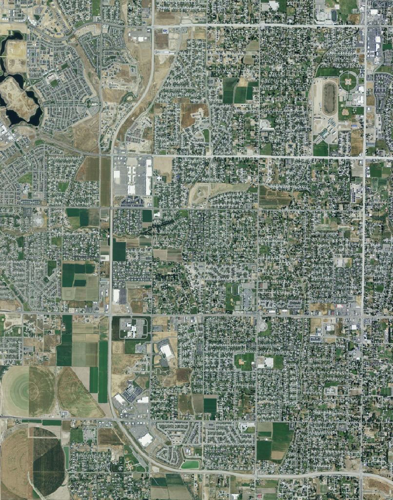
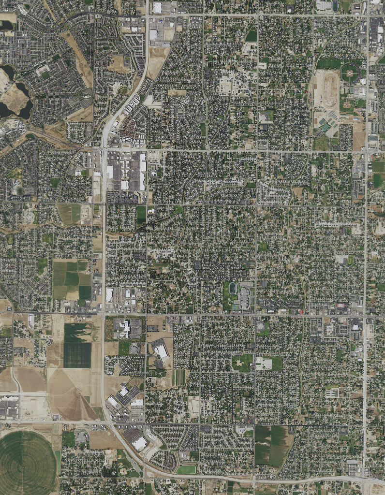

#

# The NAIP product

## Identification Information
- **Citation**:
  - **Citation Information**:
    - Originator: USDA-FSA-APFO Aerial Photography Field Office
    - Publication Date: 20111108
    - Title: NAIP Digital Ortho Photo Image
    - Geospatial Data Presentation Form: remote-sensing image
    - **Publication Information**:
      - Publication Place: Salt Lake City, Utah
      - Publisher: USDA-FSA-APFO Aerial Photography Field Office

## Description
- **Abstract**:
  - This data set contains imagery from the National Agriculture Imagery Program (NAIP). NAIP acquires digital ortho imagery during the agricultural growing seasons in the continental U.S. A primary goal of the NAIP program is to make ortho imagery available within one year of acquisition. NAIP offers four main products: 1-meter GSD ortho imagery rectified to a horizontal accuracy of within +/- 5 meters of reference DOQQs from NDOP; 2-meter GSD ortho imagery rectified to within +/- 10 meters of reference DOQQs; 1-meter GSD ortho imagery rectified to within +/- 6 meters to true ground; and 2-meter GSD ortho imagery rectified to within +/- 10 meters to true ground. The tiling format of NAIP imagery is based on a 3.75' x 3.75' quarter quadrangle with a 300-meter buffer on all sides, formatted to the UTM coordinate system using NAD83. NAIP imagery may contain up to 10% cloud cover per tile.
- **Purpose**:
  - NAIP imagery is intended to provide current agricultural conditions in support of USDA farm programs. The 1-meter GSD product is used for Common Land Unit boundaries and other data sets. The 1-meter NAIP imagery is usually acquired in full-state projects in cooperation with state government and other federal agencies for various purposes, including land use planning and natural resource assessment. NAIP is also used for disaster response, providing current pre-event imagery. The 2-meter GSD NAIP imagery, primarily for assessing crop condition and compliance with USDA farm program conditions, is typically acquired only for agricultural areas within state projects.

## Time Period of Content
- **Time Period Information**:
  - Single Date/Time:
    - Calendar Date: 20110720
- Currentness Reference: Ground Condition

## Status
- Progress: Complete
- Maintenance and Update Frequency: Irregular

## Spatial Domain
- **Bounding Coordinates**:
  - West Bounding Coordinate: -112.0000
  - East Bounding Coordinate: -111.9375
  - North Bounding Coordinate: 40.5625
  - South Bounding Coordinate: 40.5000

## Keywords
- **Theme**:
  - Theme Keyword Thesaurus: None
  - Theme Keywords: farming, Digital Ortho rectified Image, Ortho Rectification, Quarter Quadrangle Centered, NAIP, Aerial Compliance, Compliance
- **Place**:
  - Place Keyword Thesaurus: Geographic Names Information System
  - Place Keywords: UT, Salt Lake, 49035, UT035, SALT LAKE CO UT FSA, 4011125, MIDVALE, SW, MIDVALE

## Access Constraints
- There are no limitations for access.

## Use Constraints
- Imagery may be replaced to address defects found in a small number of products through quality assurance processes. Imagery containing defects requiring new imagery acquisition, such as excessive cloud cover, specular reflectance, etc., will not be replaced within a NAIP project year.

## Point of Contact
- **Contact Information**:
  - **Contact Organization Primary**:
    - Contact Organization: Aerial Photography Field Office (APFO)
  - **Contact Address**:
    - Address Type: mailing and physical address
    - Address: 2222 West 2300 South, Salt Lake City, Utah, 84119-2020, USA
  - Contact Voice Telephone: 801-844-2922
  - Contact Facsimile Telephone: 801-956-3653
  - Contact Electronic Mail Address: apfo.sales@slc.usda.gov

## Browse Graphic
- Browse Graphic File Name: None
- Browse Graphic File Description: None
- Browse Graphic File Type: None

## Native Data Set Environment
- Unknown

## Data Quality Information
- **Logical Consistency Report**:
  - NAIP 3.75 minute tile file names are based on the USGS quadrangle naming convention.
- Completeness Report: None
- **Positional Accuracy**:
  - **Horizontal Positional Accuracy**:
    - Horizontal Positional Accuracy Report: FSA Digital Orthophoto Specs.

## Lineage
- **Source Information**:
  - **Source Citation**:
    - **Citation Information**:
      - Originator: USDA-FSA-APFO Aerial Photography Field Office
      - Publication Date: 20111108
      - Title: MIDVALE, SW
      - Geospatial Data Presentation Form: remote-sensing image
  - Type of Source Media: Unknown
  - **Source Time Period of Content**:
    - **Time Period Information**:
      - Single Date/Time:
        - Calendar Date: 20110720
    - Source Currentness Reference: Aerial Photography Date for aerial photo source.
  - Source Citation Abbreviation: Georectified Image
  - Source Contribution: Digital Georectified Image.

- **Process Step**:
  - Process Description: Digital imagery was collected at a nominal GSD of 1.0m using three Cessna 441 aircrafts flying at an average flight height of 9052m AGL. N14NW, N16NW flew with Leica Geosystem's ADS80/SH82 digital sensors sn30017 & sn30034 both with firmware 3.15. N911PJ flew with Leica Geosystem's ADS40/SH52 digital sensor sn30014 with firmware v2.14. Each sensor collected 11 image bands. PanF27A, PanF02A, and PanB14A panchromatic bands with a spectral range of 465-676nm. RedN00a and RedB16a with a spectral range of 604-664nm. GrnN00a and GrnB16a with a spectral range of 533-587nm. BluN00a and BluB16a with a spectral range of 420-492nm and Near-infrared bands NirN00a and NirB16a with a spectral range of 833-920nm. The CCD arrays have a pixel size of 6.5 microns in a 12000x1 format. Both the CCD's and the A/D convertors have a dynamic range of 12bits. The data is stored in 16bit format. The ADS is a push-broom sensor and the ground footprint of the imagery at NAIP scale is 12km wide by the length flightline. The maximum flightline length is limited to approximately 240km. The factory calibrations and IMU alignments for each sensor (sn30017 8/6/2009, sn30014 5/15/2008 and sn30034 12/7/2007) were tested and verified by in-situ test flights before the start of the project. The Leica ADS Flight Planning and Evaluation Software (FPES) is used to develop the flight acquisition plans. Flight acquisition sub blocks are designed first to define the GNSS base station logistics, and to break the project up into manageable acquisition units. The flight acquisition sub blocks are designed based on the specified acquisition season, native UTM zone of the DOQQs, flight line length limitations (to ensure sufficient performance of the IMU solution) as well as air traffic restrictions in the area. Once the sub blocks have been delineated they are brought into FPES for flight line design. The design parameters used in FPES will be 30% lateral overlap and 1.0m resolution. The flight lines have been designed with a north/south orientation. The design takes into account the latitude of the state, which affects line spacing due to convergence as well as the terrain. SRTM elevation data is used in the FPES design to ensure the 1m GSD is achieved over all types of terrain. The raw data was downloaded from the sensors after each flight using Leica XPro software. The imagery was then georeferenced using the 200Hz GPS/INS data creating an exterior orientation for each scan line (x/y/z/o/p/k). Technicians precisely measured tie points in 3 bands/looks (Back/Nadir/Forward) for each line using Leica Xpro software. The resulting point data and exterior orientation data were used to perform a full bundle adjustment with ORIMA software. Blunders were removed, and additional tie points measured in weak areas to ensure a robust solution. Once the point data was clean and point coverage was acceptable, photo-identifiable GPS-surveyed ground control points were introduced into the block adjustment. The bundle adjustment process produces revised exterior orientation data for the sensor with GPS/INS, datum, and sensor calibration errors modeled and removed. Using the revised exterior orientation from the bundle adjustment, orthorectified image strips were created with Xpro software and the May 2011 USGS 10m NED DEM. The Xpro orthorectification software applies an atmospheric-BRDF radiometric correction to the imagery. This correction compensates for atmospheric absorption, solar illumination angle and bi-directional reflectance. The orthorectified strips were then overlaid with each other and the ground control to check accuracy. Once the accuracy of the orthorectified image strips were validated the strips were then imported into Inpho's OrthoVista 4.5 package which was used for the final radiometric balance, mosaic, and DOQQ sheet creation. The final DOQQ sheets, with a 300m buffer and a ground pixel resolution of 1m were then combined and compressed to create the county-wide CCMs.

  - Process Date: 20111108

## Spatial Data Organization Information
- Indirect Spatial Reference: Salt Lake County, UT
- Direct Spatial Reference Method: Raster
- **Raster Object Information**:
  - Raster Object Type: Pixel
  - Row Count: 1
  - Column Count: 1

## Spatial Reference Information
- **Horizontal Coordinate System Definition**:
  - **Planar**:
    - **Grid Coordinate System**:
      - Grid Coordinate System Name: Universal Transverse Mercator
      - **Universal Transverse Mercator**:
        - UTM Zone Number: 12
        - **Transverse Mercator**:
          - Scale Factor at Central Meridian: 0.9996
          - Longitude of Central Meridian: -111.0
          - Latitude of Projection Origin: 0.0
          - False Easting: 500000
          - False Northing: 0.0
    - **Planar Coordinate Information**:
      - Planar Coordinate Encoding Method: row and column
      - **Coordinate Representation**:
        - Abscissa Resolution: 1
        - Ordinate Resolution: 1
      - Planar Distance Units: meters
  - **Geodetic Model**:
    - Horizontal Datum Name: North American Datum of 1983
    - Ellipsoid Name: Geodetic Reference System 80 (GRS 80)
    - Semi-major Axis: 6378137
    - Denominator of Flattening Ratio: 298.257

## Entity and Attribute Information
- **Overview Description**:
  - **Entity and Attribute Overview**:
    - 32-bit pixels, 4 band color (RGBIR) values 0 - 255
  - Entity and Attribute Detail Citation: None

## Distribution Information
- **Distributor**:
  - **Contact Information**:
    - **Contact Person Primary**:
      - Contact Person: Supervisor Customer Services Section
      - Contact Organization: USDA-FSA-APFO Aerial Photography Field Office
    - **Contact Address**:
      - Address Type: mailing and physical address
      - Address: 2222 West 2300 South, Salt Lake City, Utah, 84119-2020, USA
    - Contact Voice Telephone: 801-844-2922
    - Contact Facsimile Telephone: 801-956-3653
    - Contact Electronic Mail Address: apfo.sales@slc.usda.gov
- **Distribution Liability**:
  - In no event shall the creators, custodians, or distributors of this information be liable for any damages arising out of its use (or the inability to use it).
- **Standard Order Process**:
  - **Digital Form**:
    - **Digital Transfer Information**:
      - Format Name: GeoTIFF - Georeferenced Tagged Image File Format
      - Format Information Content: Multispectral 4-band
    - **Digital Transfer Option**:
      - **Offline Option**:
        - Offline Media: CD-ROM
        - Recording Format: ISO 9660 Mode 1 Level 2 Extensions
  - Fees: Contact the Aerial Photography Field Office for more information
- Resource Description: m_4011125_sw_12_1_20110720_20111011.tif

## Metadata Reference Information
- Metadata Date: 20111108
- **Metadata Contact**:
  - **Contact Information**:
    - **Contact Organization Primary**:
      - Contact Organization: USDA-FSA-APFO Aerial Photography Field Office
    - **Contact Address**:
      - Address Type: mailing and physical address
      - Address: 2222 West 2300 South, Salt Lake City, Utah, 84119-2020, USA
    - Contact Voice Telephone: 801-844-2922
- Metadata Standard Name: Content Standard for Digital Geospatial Metadata
- Metadata Standard Version: FGDC-STD-001-1998

Metadata obtained from: [https://naipeuwest.blob.core.windows.net/naip/v002/ut/2011/ut_fgdc_2011/40111/m_4011125_sw_12_1_20110720.txt](https://naipeuwest.blob.core.windows.net/naip/v002/ut/2011/ut_fgdc_2011/40111/m_4011125_sw_12_1_20110720.txt)

  
  

