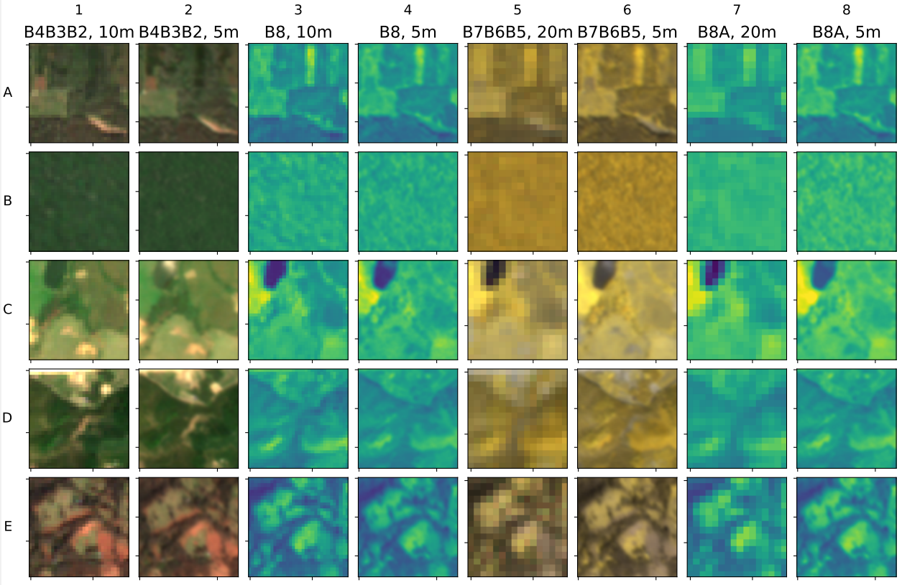

#

# The Venµs product

The Venµs images featured in the study were sourced from the Sen2Venµs dataset. Notably, as of the publication of this article, it is the only dataset that offers a genuine harmonization pipeline. More details about the harmonization process can be found in the [Sen2Venµs paper](https://www.mdpi.com/2306-5729/7/7/96).

  

