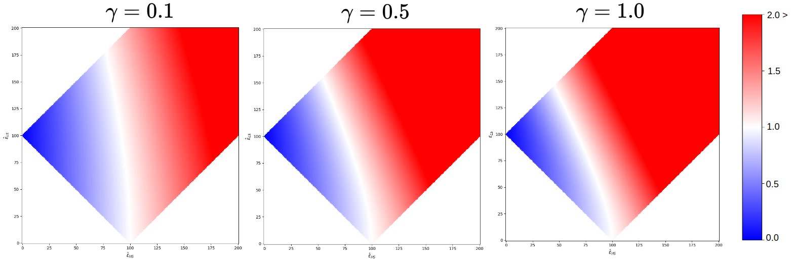
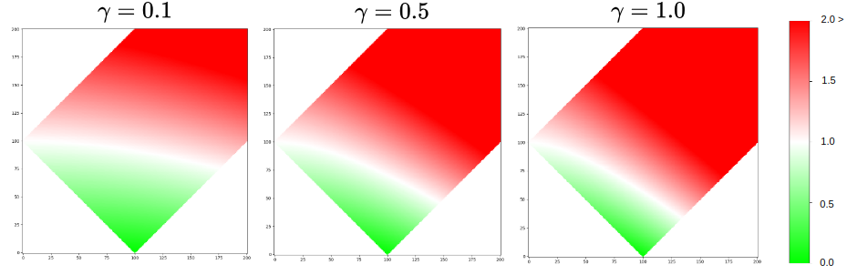
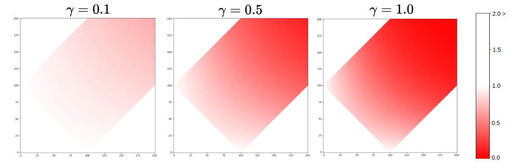

# 

## **The correctness scores**

It evaluates the quality of high-frequency information introduced by the SR model. Three correctness scores are implemented in `opensr-test`: improvement, omission, and hallucination. The correctness scores depend on the distance metric set by the user.

Each score reveals different aspects of the SR model performance:

**Improvement**: Low values represent a good match between the SR and HR images. The equation for calculating improvement is:

$H = d_{im} + d_{om} - 1$

$Improvement = d_{im} + d_{om}*(1 - e^{-\gamma H})$

  

Where:

- $d_{im}$ is the distance between the SR and HR images.
- $d_{om}$ is the distance between the SR and LR images.

**Omission**: Low values are related to the inability to represent high-frequency information from the HR and keep similar to the LR image. The equation for calculating omission is:

$H = d_{im} + d_{om} - 1$

$Omission = d_{om} + d_{im}*(1 - e^{-\gamma H})$

  

**Hallucination**: Low values shows the areas where the SR model has introduced high-frequency information that is not present in the HR image. The equation for calculating hallucination is:

$Hallucination = e^{-\gamma * d_{om} * d_{im}}$

  

