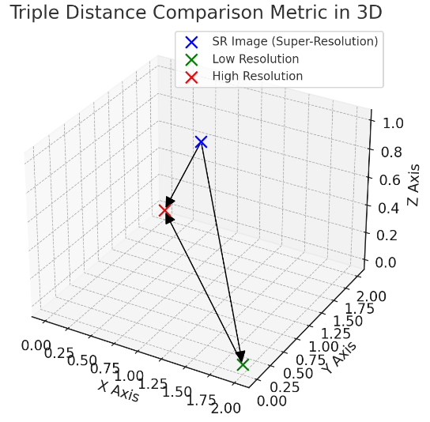

# 

## Triple distance metrics

The triple distance metrics are used to evaluate if the SR product is closer
to the HR product or to the LR product. The distance metrics are calculated two times: once between the SR and HR images, and once between the SR and LR images. Apart from the metrics described in the consistency metrics, we also introduce the cross-sensor MTF, LPIPS and CLIP metrics.

  

**Cross-sensor MTF**: The "Cross-sensor Modulation Transfer Function (MTF)" involves comparing the MTF between two different sensors. The MTF itself is a critical measure of an imaging system's capability to resolve detail in an object (ground sampling distance). Analyzing the curve permit us to understand how effectively the SR model can reproduce detail at different scales. The reported metric is the comparison of the area under the MTF curve between the LR and SR images, from the Nyquist frequency of LR (Sentinel-2) to the super-resolved image.

$\text{Cross-sensor MTF} = \int_{f_{\text{Nyquist, LR}}}^{f_{\text{max, SR}}} MTF_{\text{LR}}(f) - MTF_{\text{SR}}(f) \, df$

**LPIPS**: The Learned Perceptual Image Patch Similarity (LPIPS) metric is a perceptual metric that aims to quantify the perceptual similarity between two images. The LPIPS metric is based on a deep neural network that was trained to predict perceptual similarity scores. The reported metric is the average LPIPS score between the LR and SR images.

$\text{LPIPS} = \sum_{l=1}^{L} w_l \cdot \frac{1}{H_lW_l} \sum_{h=1}^{H_l} \sum_{w=1}^{W_l} \| \phi_l(I_1)_{h,w} - \phi_l(I_2)_{h,w} \|_2^2$

In this equation:
    
- $LPIPS$ is the Learned Perceptual Image Patch Similarity score.
- $L$ denotes the number of layers in a deep neural network used for comparison.
- $w_l$ represents the weight of the $l-th$ layer in the network.
- $\phi_l(l)_{I}$ is the feature map of image $I$ at layer $l$.
- $H_l$ and $W_l$ are the height and width of the feature map at layer $l$, respectively.
- $I_1$ and $I_2$ are the two images being compared.
- The summations across $h$ and $w$ are over the spatial dimensions of the feature maps.

**CLIPscore**

Proposed by Wolters et. al 2023 in [Zooming Out on Zooming In: Advancing Super-Resolution for Remote Sensing](https://arxiv.org/abs/2311.18082). CLIPscore measures the distance in image embedding space between the HR|LR and the SR image using the [CLIP](https://github.com/openai/CLIP) model. Unlike LPIPS, with CLIPscore we can focus mainly in the contextual and semantic integrity of the super-resolved images. The reported metric is the cosine similarity between the image embeddings of the HR|LR and SR images.
